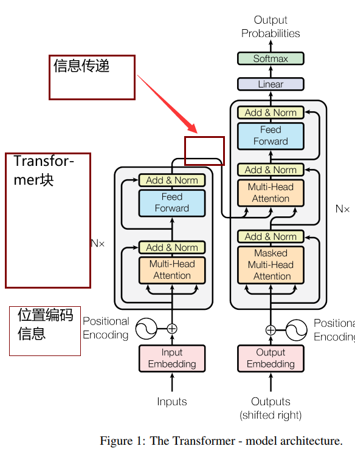
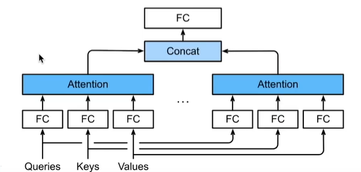
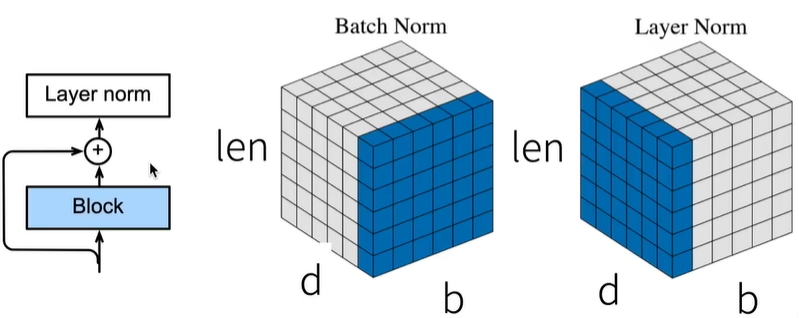

### 基于编码器解码器架构

#### 基于编码器-解码器的架构来处理序列对

#### 跟使用注意力的Seq2Seq不同 Transformer是纯基于注意力

#### Multi-head attention多端注意力

#### 对于同一key, value, query希望抽取不同的信息

##### 例如短距离关系和长距离关系，对于不同尺度的特征进行抽取，有点像是卷积层中输出不止一个维度的信息抽取

#### 多端注意力使用h个独立的注意力池化

##### 合并各个端的特征(head)输出得到最终concat输出

$query\quad q\in R^{d_q}, key \quad k \in R^{d_k}, value \quad v\in R^{d_v}$

端i可学习参数$W^{(q)}_i \in R^{p_q \times d_q}, W^{(k)}_i \in R^{p_k \times d_k},W^{(v)}_i \in R^{p_v \times d_v}$

端i的输出$h_i=f(W^{(q)}_i q, W^{(k)}_i k, W^{(v)}_i v) \in R^{p_v}$

输出的可学习参数$W_0\in R^{p_0 \times hd_v}$

#### 有掩码的多头注意力

##### 解码器对序列中一个元素输出时，不应该考虑该元素之后的元素

##### 可通过掩码来实现，假如说当前该输出$x_i$元素，且当前的序列长度为i,则通过掩码在解码时不会给$x_i$后面的元素权重

#### 基于位置的前馈神经网络

##### 将输入形状由(b,n,d)变换成(bn, d)

##### 作用两个全连接或者kernel为1的conv

##### 将输出形状由(bn, d)变回(b,n,d)

#### Add&Norm

##### Add就是一个残差块

##### Norm就是LayerNormalization

##### 批量归一化对于每个特征/通道里面面的元素进行归一化

###### 不适合序列长度会变的NLP应用

##### 层归一化对每个样本里面的元素进行归一化

#### 信息传递

##### 编码器中的输出y1......yn

##### 将其作为解码中第i个Transformer块中多端注意力的key和value

* 它query来自目标序列

##### 意味着编码器和解码器的块数和输出都是一样的，为了简单和对称

